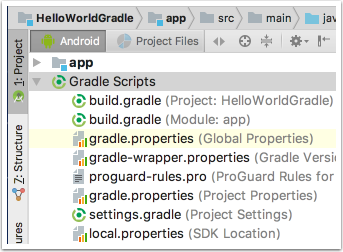

# Gradle--构建Android App

### 用Android Studio构建一个初始化Android项目


在“Android” mode可以看到如上图的gradle 项目目录。
在主目录和子目录分别有一个build.gradle文件(build.gradle(Project:HelloWorldGradle和build.gradle(Module:ap))),项目中可能还会有两个gradle.properties文件，其中一个是项目的配置文件，另一个只在你有一个全局的gradle.properties文件才会有。
setting.gradle文件是Gradle用来配置多工程项目的，它应该只有一行代码:
`include ':app'`
这行代码告诉Gradle  app子目录依旧是一个Gradle项目，之后，如果需要添加Android Library到这个项目，依旧需要添加到这个文件中。
最后一个文件gradle-wrapper.properties是配置Gradle Wrapper,这个文件允许你在没有下载Gradle的时候构建Android项目，文件的内容和下面几行代码相似:
```gradle
distributionBase=GRADLE_USER_HOME
distributionPath=wrapper/dists
zipStoreBase=GRADLE_USER_HOME
zipStorePath=wrapper/dists
distributionUrl=https\://services.gradle.org/distributions/gradle-4.1-all.zip
```
前四行表明当wrapper第一次运行时，将会下载Gradle相关文件并将它保存在主文件目录下的.gradle/wrapper/dists文件里。

### 主目录下的Gradle Build 文件
```gradle
//build.gradle
// Top-level build file where you can add configuration options common to all sub-projects/modules.

buildscript {              //①   
    repositories {
        google()
        jcenter()
    }
    dependencies {            //②
        classpath 'com.android.tools.build:gradle:3.0.1'

        // NOTE: Do not place your application dependencies here; they belong
        // in the individual module build.gradle files
    }
}

allprojects {                 //③
    repositories {
        google()
        jcenter()
    }
}

task clean(type: Delete) {    //④
    delete rootProject.buildDir
}
```
①  下载插件
②　标识Android 插件
③　顶级和模块项目的配置
④　Ad hoc task(临时任务)
buildscript　标签表明　项目所依赖的插件下载的仓库，在本项目中，这个插件有自己唯一的 坐标语法"group:name:version"，group是`com.android.tools.build`name是`gradle`,version是`3.0.1`
> 版本号(version)是不断更新的，请使用最新的gradle插件
在gradle构建第一次项目时，相关插件会被下载并缓存，所以这只会执行一次

allprojects　标签里是项目的顶级项目和子项目运用的配置细节，在这里，这个代码块是说明所有需要的依赖都会从`google`和`jcenter`上下载。

最后，文件有自定义的任务（clean）, 它使用gradle内置的任务类型　`Delete`

### app 模块下的build文件
build.gradle文件的第一行代码是
`apply plugin: 'com.android.application'`
上面一行代码的作用是把此Android插件应用到当前项目中，Gradle中的插件可以添加自定义任务、新配置、依赖库和一些功能到Gradle项目，在这里，应用Android插件添加了很多任务，这些任务在下面的`android`代码块中展示
```gradle
android {
    compileSdkVersion 26
    defaultConfig {
        applicationId "org.gradle.helloworldgradle"
        minSdkVersion 19
        targetSdkVersion 26
        versionCode 1
        versionName "1.0"
        testInstrumentationRunner "android.support.test.runner.AndroidJUnitRunner"
    }
    buildTypes {
        release {
            minifyEnabled false
            proguardFiles getDefaultProguardFile('proguard-android.txt'), 'proguard-rules.pro'
        }
    }
}
```
简单说明：
- `compileSdkVersion`和Android SDK相关，应该设置为最新版本
- `defaultConfig`里的属性是app的共享变量
- `applicationId`　在Google Play store中值唯一，它基于　domain name 和project name 
- `minSdkVersion`的值是app支持的最小Android API的版本号，`targetSdkVersion`是最新的Android version号

### 运行标准的Gradle任务
打开一个终端进入根目录
`$ ./gradlew build`
运行结果如下：

```
$ ./gradlew :app:dependencies --configuration releaseCompileClasspath
:app:dependencies

------------------------------------------------------------
Project :app
------------------------------------------------------------

releaseCompileClasspath - Resolved configuration for compilation for variant: release
+--- com.android.support:appcompat-v7:26.1.0
|    +--- com.android.support:support-annotations:26.1.0
|    +--- com.android.support:support-v4:26.1.0
|    |    +--- com.android.support:support-compat:26.1.0
|    |    |    +--- com.android.support:support-annotations:26.1.0
|    |    |    \--- android.arch.lifecycle:runtime:1.0.0
|    |    |         +--- android.arch.lifecycle:common:1.0.0
|    |    |         \--- android.arch.core:common:1.0.0
|    |    +--- com.android.support:support-media-compat:26.1.0
|    |    |    +--- com.android.support:support-annotations:26.1.0
|    |    |    \--- com.android.support:support-compat:26.1.0 (*)
|    |    +--- com.android.support:support-core-utils:26.1.0
|    |    |    +--- com.android.support:support-annotations:26.1.0
|    |    |    \--- com.android.support:support-compat:26.1.0 (*)
|    |    +--- com.android.support:support-core-ui:26.1.0
|    |    |    +--- com.android.support:support-annotations:26.1.0
|    |    |    \--- com.android.support:support-compat:26.1.0 (*)
|    |    \--- com.android.support:support-fragment:26.1.0
|    |         +--- com.android.support:support-compat:26.1.0 (*)
|    |         +--- com.android.support:support-core-ui:26.1.0 (*)
|    |         \--- com.android.support:support-core-utils:26.1.0 (*)
|    +--- com.android.support:support-vector-drawable:26.1.0
|    |    +--- com.android.support:support-annotations:26.1.0
|    |    \--- com.android.support:support-compat:26.1.0 (*)
|    \--- com.android.support:animated-vector-drawable:26.1.0
|         +--- com.android.support:support-vector-drawable:26.1.0 (*)
|         \--- com.android.support:support-core-ui:26.1.0 (*)
\--- com.android.support.constraint:constraint-layout:1.0.2
     \--- com.android.support.constraint:constraint-layout-solver:1.0.2

(*) - dependencies omitted (listed previously)


BUILD SUCCESSFUL
```
从输出来看，可以看到`support-annotations`模块的版本是26.1.0，是appcompat-v7库的依赖。