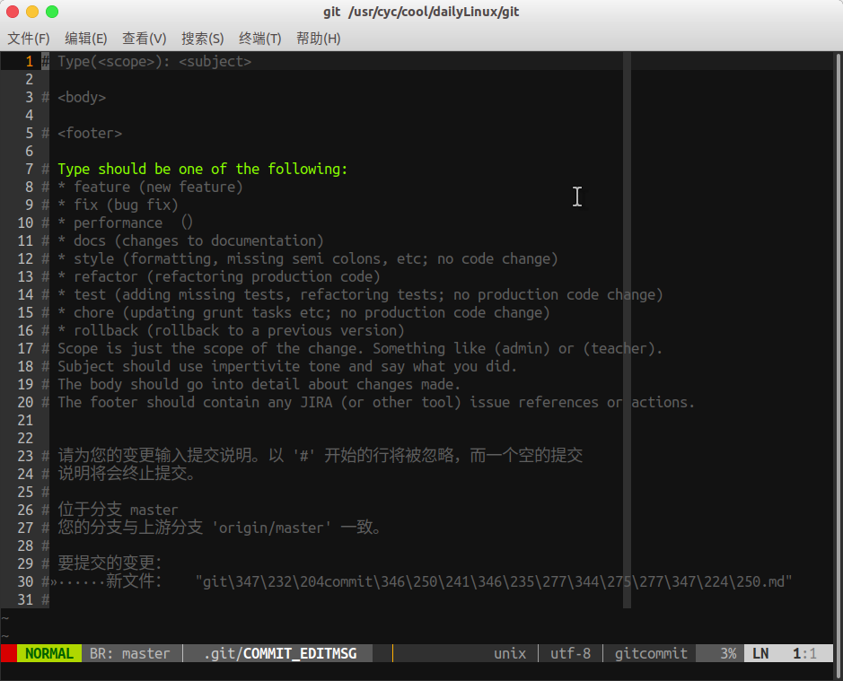

# git commit 模板设置

首先建立一个文件，这里我取名为 `.gitcommittemplate` ，文件内容为

```
# Type(<scope>): <subject>

# <body>

# <footer>

# Type should be one of the following:
# * feature (new feature)
# * fix (bug fix)
# * performance （）
# * docs (changes to documentation)
# * style (formatting, missing semi colons, etc; no code change)
# * refactor (refactoring production code)
# * test (adding missing tests, refactoring tests; no production code change)
# * chore (updating grunt tasks etc; no production code change)
# * rollback (rollback to a previous version)
# Scope is just the scope of the change. Something like (admin) or (teacher).
# Subject should use impertivite tone and say what you did.
# The body should go into detail about changes made.
# The footer should contain any JIRA (or other tool) issue references or actions.
```

然后命令行进行模板设置

只对本分支生效

```bash
git config commit.template .gitcommittemplate
```

全局生效

```bash
git config --global commit.template .gitcommittemplate
```


然后设置编辑器

```bash
git config core.editor vim
//or
git config --global core.editor vim
```


这样每次提交时只需

```bash
git commit
```

这时会自动进入vim，效果为


