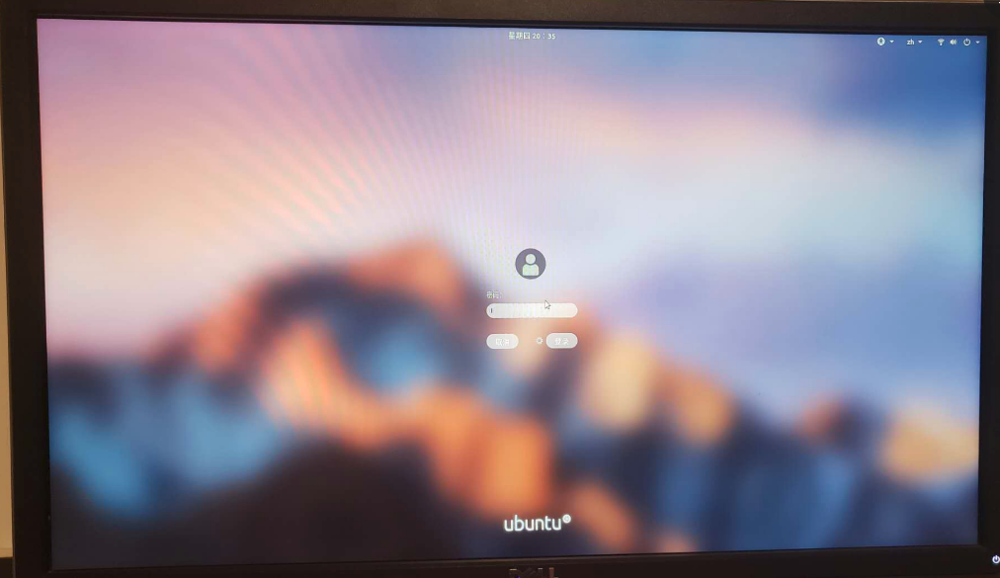

# macOS 主题

> 引用链接　[给Ubuntu18.04安装mac os主题](https://www.cnblogs.com/feipeng8848/p/8970556.html)  只是为了备份

## 给 Ubuntu18.04 安装 mac os 主题

关于几个目录，GTK、Shell 的目录是：/usr/share/themes，图标的目录是/usr/share/icons。
放到/usr/share/下是全局修改，也就是说如果你换一个账户登陆，也是可以用这些主题文件的。弊端就是操作较复杂，需要 sudo 权限。
如果仅仅是想修改当前账户的主题，可以选择在/home/YourAccount/（比如 /home/feipeng8848/）下新建两个目录：.themes 和 .icons。注意，目录名称前面有个点 “ . ” ，然后把 shell、GTK 主题文件放到 .themes 中，图标文件放到 .icons 中。

---

安装完的效果：


参考：

https://linuxhint.com/gnome-tweak-tool-ubuntu-17-10/

---

下面正式开始

---

要安装主题，首先要先安装相应的工具：TweakTool

```

sudo apt-sudo apt-getget update
sudo apt update sudo apt--getget install gnome-tweak-tool install gnome-tweak-tool

```


下图就是安装完后，打开的 Tweaks


修改窗口的按钮位置


Before:


After:


现在按钮位置就修改到左边了


显示或隐藏桌面上的图标


修改鼠标图标


去掉 Shell 上无法修改的叹号


执行下面的命令

```
sudo apt-get install gnome-shell-extensions

```


安装完成后打开 Tweaks 选择 “Extensions”选项


“User themes” 按钮设置成 on


去“Appearances”选项，就能发现 Shell 那里没有叹号了


---

到现在我们已经把工具安装配置完成了，下面正式安装主题

---

1.安装 GTK 主题
去这个链接：~~https://www.opendesktop.org/s/Gnome/p/1171688/~~

上面的链接挂了，可使用其他相关链接：

1.https://www.opendesktop.org/s/Gnome/p/1013714/

2.https://www.opendesktop.org/s/Gnome/p/1241688


网页上有好几个标签：Prodect、FIles、Changelogs 等等

找到 Files 标签，去下载文件。点击文件名就可以下载。


可以看到这里一共有 6 个压缩文件，分别包装各种主题。通过文件名能发现每一个文件都有一个“2”，这个 2 的意思是该压缩包下有两个主题。

随便选中一个比如 Gnome-OSC-HS--2themes.tar.xz（第一个文件），下载下来。

通过 xz 和 tar 命令解压

```bash
xz -d Gnome-OSC-HS--2-themes.tar.xz
tar xvf Gnome-OSC-HS--2-themes.tar
```

解压后得到的文件夹中有两个文件夹


这两个文件夹分别是两个主题，把这两个文件夹移动到/usr/share/themes 下就可以了。

然后打开前面安装的工具 Tweaks（中文下叫“优化”）,在“应用程序”英文是“Applications”这个选项下就可以选择刚刚安装的主题了。这几个截图是我安装主题后的截图。


刚刚是两个文件夹，就是两个主题，这两个主题从名字上看只有 transparent 前面是否有个 not，顾名思义就是有没有透明效果。

到现在已经修改了外观样式，最大化最小化的样式已经很苹果了。

2.修改图标
去下面的链接下载

https://www.opendesktop.org/s/Gnome/p/1102582/


解压后把文件都放到/usr/share/icons 目录下，如下图（这是已经应用过主题的截图）所示：


然后去 Tweaks 中应用一下


3.修改桌面 Shell
去这个链接：https://www.opendesktop.org/s/Gnome/p/1013741/

下载下面红框里的


应用下（/usr/share/themes）


效果：


---

2018-09-09 更新

关于 grub2，开机选择部分。

---

找到/boot/grub/grub.cfg 文件，找到这样一行： if background_color 44,0,30,0;修改成 if background_color 0,0,0,0;就会去除 grub 在选中 Ubuntu 系统之后出现的短暂的紫色。

对于 grub 的主题，我选的是 Grub-theme-vimix，如下图：


解压后执行文件夹中的 install 即可。

---

2018-05-09 更新

关于 plymouth theme，开机动画。

---


如上图所示，/etc/alternatives/default.plymouth 文件指定了一个 logo 文件夹，指定了一个执行脚本。开机的时候就用这个文件指定的 logo 和脚本执行。

那么思路就是，把 logo 文件夹和脚本指定成别的就可以修改开机动画。

开机动画主题没找到好看的，试一下这个吧


下载下压缩包，解压后：


把解压的文件 mv 到 /usr/share/plymouth/themes/目录下


然后去修改下/etc/alternatives/default.plymouth（先备份源文件）成如下


实际图示就类似下图，不过中间的 logo 是会转动的（手机录制的不好看就不贴 gif 了）

---

2018-05-10 更新

GDM（GNOME Display Manager，GDM）主题，也就是登录界面的主题

---

选了一个主题https://www.opendesktop.org/s/Gnome/p/1207015/，如下


解压压缩包


该文件夹下有三个文件


先说明下修改登录界面样式的原理：

重要步骤是在 css 文件，这个/usr/share/gnome-shell/theme/ubuntu.css 就配置了登录界面的样式。

在/usr/share/gnome-shell/theme/ubuntu.css 文件（上面我下载的包中，非系统自带的这个 css 文件）中有这样一行代码：


是的，Ubuntu18.04 的登录界面是用 css 文件渲染的，做网页前端的应该最熟悉不过了。

如果你只想替换登录界面的背景，把系统自带的这个 css 文件中指定图像文件的位置修改成你自己的图片的绝对目录就行了。

当然，如果你想让你的登录界面炫酷一些，修改 css 文件，渲染成你想要的效果即可。

或者你想省事，那就和我一样去网上下载别人写好的 css 文件。

在我下载的


中，还有个脚本文件，内容如下：


有注释，这个脚本的作用是把你现在正在用的壁纸模糊处理，然后放到 ~/Pictures/gdm_look.jpg，执行过脚本后，你的 ~/Pictures 目录下就会多一个 gdm_look.jpg 文件，这个文件就是你当前用的壁纸的模糊处理过后的图片。

然后 ~/Pictures/gdm_look.jpg 又被复制到/usr/share/backgrounds/目录下，再看下面这个图


这个包中提供的 css 文件指定的登录页面壁纸，也就是脚本处理完后 cp 到/usr/share/backgrounds/的 gdm_look.jpg。

至此，原理说明白了，操作如下：

备份/usr/share/gnome-shell/theme/ubuntu.css

```
sudo cp /usr/share/gnome-shell/theme/ubuntu.css /usr/share/gnome-shell/theme/ubuntu.css.backup
```

用下图中的 ubuntu.css 替换掉系统自带的/usr/share/gnome-shell/theme/ubuntu.css


把 SetAsWallpaper 脚本文件复制到~/.local/share/nautilus/scripts/目录下，然后修改下权限（如果需要）

```
sudo chmod +x SetAsWallpaper
```

然后重启 nautilus（下面的命令是关闭）

```
nautilus -q
```

点击桌面右下角“所有应用”，查找“nautilus ”


执行如下命令，修改下 /usr/share/backgrounds 的权限.

```
sudo chmod 777 /usr/share/backgrounds/
```

最后一步，去~/.local/share/nautilus/scripts/ 目录下执行下 SetAsWallpaper 脚本。

重启系统就好了。（执行脚本后，你的桌面壁纸可能会没了，重新设置下就好了）

最后放一张效果图：



---

2018-05-12 更新

TopBar

---

我使用的 gnome-shell 主题


是它的 TopBar 是这样的字体略粗，且很宽太占空间。


修改后的样子


这样明显好看一些。

下面正式开始修改，由于我是用的 Sierra-compact-light 主题，所以要去这个主题下面的配置文件（其实是一个 css 文件）修改，就是下面的目录

```
/usr/share/themes/Sierra-compact-light/gnome-shell/gnome-shell.css
```

如果你是想修改 Ubuntu 默认的 TopBar 就不是上面这个目录了而应该是 Ubuntu 默认 Shell 的目录，可能是下面几个文件中修改，因为我没试过，所以不确定具体是哪个文件。


回到/usr/share/themes/Sierra-compact-light/gnome-shell/gnome-shell.css 文件，也就是我的主题文件，ctrl+f 找#panel

修改 TopBar 高度


加粗字体改成正常字体


保存重启就好了。

---

2018-05-19 更新

Dash to Dock

---

打开 Ubuntu Software，直接搜索 dash to dock，安装上。


打开 Tweaks -> Extensions，注意，这里不要打开 Dash to Dock 扩展，修改样式直接点击齿轮按钮就好，我尝试打开，但是锁屏后再进入桌面会有 bug。


我的设置如下


效果：


比起 docky 这个的好处是直接修改的系统的 dock，而 docky 是直接添加了一 dock 且系统自带的 dock 也不能移除，但 docky 有 macOS 的放大效果这个没有。

——————————————————————————————————————————————————————————
