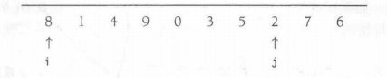

# 排序

### 插入排序
（简单）
主要思想是从下标为1的位置开始向后走，每次插入到目标位置
```
 public static <AnyType extends Comparable<? super AnyType>> void insertionSort(AnyType[] a){
        int k;
        for (int i = 1; i < a.length; i++) {
            AnyType tmp=a[i];
            for (k = i; k >0 && tmp.compareTo(tmp)<0 ; k--) {
                a[k]=a[k-1];
            }
            a[k]=tmp;
        }
    }
```

### 希尔排序

他通过比较相距一定间隔的元素来工作；各趟比较所用的距离随算法的进行而减小，知道比较相邻元素的最后一趟的排序为止。
希尔排序使用一个序列h<sub>1</sub>,h<sub>2</sub>,h<sub>3</sub>....h<sub>k</sub>,叫做增量序列，希尔排序的一个重要性质是，一个h<sub>k</sub>排序的文件保持它的h<sub>k</sub>,排序性。
增量序列的一个流行的选择是使用Shell建议的序列：h<sub>t</sub> = $ \lfloor  N/2  \rfloor $,和 h<sub>k</sub> =$ \lfloor h_{k+1} /2 \rfloor $
```java
//         3 4 5 2 3 4 7 8  1 4                     
//(gap=5)->3 4 5 1 3 4 7 8  2 4
//(gap=2)->2 1 3 4 3 4 5 4  7 8
//(gap=1)->1 2 3 3 4 4 4 5  7 8  

 public static <AnyType extends Comparable<? super AnyType>> void shellsort(AnyType[] a) {
        int j;
        for (int gap = a.length; gap > 0; gap /= 2) {
            for (int i = gap; i < a.length; i++) {
                AnyType tmp = a[i];
                for (j = i; j >= gap && tmp.compareTo(a[j - gap]) < 0; j -= gap)
                    a[j] = a[j - gap];
                a[j] = tmp;
            }
        }
    }
```
### 堆排序
优先队列可以用于排序，基于这种思想的算法叫做 堆排序。
该算法的主要问题是使用了一个附加的数组。因此，存储需求增加一倍。回避的方法是：在每次deleteMin之后，堆缩小1.因此位于堆中最后的单元可以存放刚刚删去的元素。第一步以线性时间建立一个堆，通过每次将堆中的最后元素与第一个元素交换，执行N—1次deleteMin操作，每次堆的大小缩减1并进行下滤。
下考虑输入序列31,41,59,26,53,58,97，得到堆


代码如下：（注意 二叉堆的数据是从数组下标1开始的，此处是从0）
```
    private static int leftChild(int i){
        return 2*i+1;
    }

    public static <AnyType extends Comparable<? super AnyType>> void perDown(AnyType[]a,int i,int n){
        int child;
        AnyType tmp;
        for (tmp=a[i];leftChild(i)<n;i=child){
            child=leftChild(i);
            if (child!=n-1&&a[child].compareTo(a[child+1])<0)
                child++;
            if (tmp.compareTo(a[child])<0)
                a[i]=a[child];
            else break;
        }
        a[i]=tmp;
    }
    public static <AnyType> void swapReference(AnyType[]a,int index1,int index2){
        AnyType tmp=a[index1];
        a[index1]=a[index2];
        a[index2]=tmp;
    }
    public static <AnyType extends Comparable<? super AnyType>> void heapSort(AnyType []a){
        for (int i = a.length/2-1; i >=0 ; i--) //buildHeap
            perDown(a,i,a.length);
        for (int i=a.length-1;i>0;i--){         //deleteMax
            swapReference(a,0,i);
            perDown(a,0,i);
        }
    }
```

### 归并排序
归并排序算法的基本操作是合并两个已排序的表
合并工作历程工作的例子见下：


合并两个已经排序的表的时间显然是线性的，最多进行N-1次比较。
递归地将前半部分和后半部分数据各自归并排序，得到排序后的两个部分数据。然后使用上面的合并算法将两部分和并到一起。该算法是经典的分治（divide-and-conquer）算法策略，它将问题分（divide）成一些小的问题然后递归求解，而治（conquer）的阶段将分的阶段解得的个答案修补在一起。
```
    private static <AnyType extends Comparable<? super AnyType>>
    void mergeSort(AnyType[] a, AnyType[] tmpArray, int left, int right) {
        if (left < right) {
            int center = (left + right) / 2;
            mergeSort(a, tmpArray, left, center);
            mergeSort(a, tmpArray, center + 1, right);
            merge(a,tmpArray,left,center+1,right);
        }
    }

    private static <AnyType extends Comparable<? super AnyType>>
    void merge(AnyType[] a, AnyType[] tmpArray, int leftPos, int rightPos, int rightEnd) {
        int leftEnd = rightPos - 1;
        int tmpPos = leftPos;
        int numElement = rightEnd - leftPos + 1;
        while (leftPos <= leftEnd && rightPos <= rightEnd) {
            if (a[leftPos].compareTo(a[rightPos]) < 0)
                tmpArray[tmpPos++] = a[leftPos++];
            else tmpArray[tmpPos++] = a[rightEnd];
        }
        while (leftPos < leftEnd)              //Copy rest of first half
            tmpArray[tmpPos++] = a[leftPos++];
        while (rightPos < rightEnd)             // copy rest of right half
            tmpArray[tmpPos++] = a[rightPos++];
        for (int i = 0; i < numElement; i++) {     //copy tmpArray right
            a[rightEnd] = tmpArray[rightEnd];
        }
    }
    public static <AnyType extends Comparable<? super AnyType>>
    void merge(AnyType[] a) {
        AnyType[] tmpArray = (AnyType[]) new Comparable[a.length];
        mergeSort(a, tmpArray, 0, a.length - 1);
    }
```
### 快速排序
像归并排序一样，快速排序也是一种分治的递归算法。
先在描述最常用的快速排序的实现——“经典的快速排序”，其中输入存放在数组里，且算法不存在额外的数组
将数组S排序的基本算法有下列简单的四步组成：
1. 如果S中元素个数是0或1，则返回
2. 取S中任一元素v,称之为 枢纽元（pivot），
3. 将 $S - \{ v \}$（S中其余元素）化成两个不相交的集合： $ S_1 = \{ x ∈ S - { v } | x <= v \} $ 和 $ S_2=\{ x∈S-\{ v \} \} $
4. 返回 $quicksort(S_1)$ 后跟$ V $,继而返回 $ quicksort(S_2) $。


** 选择枢纽元 **
- 一种错误的方法
	- 选择第一个元素作为枢纽元。
- 一种安全的方法
	- 一种安全的方法是随机选取枢纽元，但随机数的生成一般开销很大
- 三数中值分割法
	- 枢纽元的最好选择是选择数组的中值，一般的做法是使用左端、右端和中心位置的三个元素的中值作为枢纽元。

８，１，４，９，６，３，５，２，７，０
它的左边元素是８，右边元素是０，中间位置$ \lfloor (left+right)/2  \rflloor $ 上的元素是６，于是枢纽的元素是　$ v=6 $.

** 分割策略**
该法的第一步是通过将枢纽元与最后的元素交换使得枢纽元离开要被分割的数据段。ｉ从第一个元素开始而ｊ从倒数第二个开始。



　此时，ｉ和ｊ已经交错，故不再交换。分割的最后一步是将枢纽元与ｉ所指向的元素交换。
　

我们必须考虑的一个重要的细节是如何处理那些等于枢纽的元素。问题在于当ｉ遇到一个等于枢纽的元素时是否应该停止，以及当ｊ遇到一个等于枢纽元的元素是否应该停止。直观地看，ｉ和ｊ应该做相同的工作，否则分割将出现偏向一方的倾向。例如，如果ｉ停止而ｊ不停，那么所有等于枢纽元的元素将被分到$ S_2$中。

### 小数组
对于很小的数组（Ｎ<= 20）,快速排序不如插入排序
原因：可以减少运行时间。一种好的截止范围是Ｎ＝１０。这种做法也避免了一些有害的退化情形，如取三个元素的中值而实际上却只有一个或二个元素的情况。
### 快速排序例程
驱动程序
```
public static <AnyType extends Comparable<? super AnyType>>
    void  quicksort(AnyType[]a){
        quicksort(a,0,a.length-1);
    }
```

> 

```
public static <AnyType extends Comparable<? super AnyType>>
    void quickSort(AnyType[] a) {
        quickSort(a, 0, a.length - 1);
    }

    private static final int CUTOFF = 3;

    public static <AnyType extends Comparable<? super AnyType>>
    void quickSort(AnyType[] a, int left, int right) {
        if (left + CUTOFF <= right) {
            AnyType pivot = median3(a, left, right);
            int i = left, j = right - 1;
            for (; ; ) {
                while (a[++i].compareTo(pivot) < 0) {
                }
                while (a[--j].compareTo(pivot) > 0) {
                }
                if (i < j)
                    swapReference(a, i, j);
                else break;
            }
            swapReference(a, i, right - 1);
            quickSort(a, left, i - 1);        //sort small element
            quickSort(a, i + 1, right);        //sort large element
        } else
            insertionSort(a, left, right);
    }

    private static <AnyType extends Comparable<? super AnyType>>
    void insertionSort(AnyType[] a, int left, int right) {
        for (int p = left + 1; p <= right; p++) {
            AnyType tmp = a[p];
            int j;

            for (j = p; j > left && tmp.compareTo(a[j - 1]) < 0; j--)
                a[j] = a[j - 1];
            a[j] = tmp;
        }
    }

    private static <AnyType extends Comparable<? super AnyType>>
    AnyType median3(AnyType[] a, int left, int right) {
        int center = (left + right) / 2;
        if (a[center].compareTo(a[left]) < 0)
            swapReference(a, left, center);
        if (a[right].compareTo(a[left]) < 0)
            swapReference(a, right, left);
        if (a[center].compareTo(a[right]) < 0)
            swapReference(a, right, center);
        swapReference(a, center, right - 1);
        return a[right - 1];
    }

    public static <AnyType> void swapReference(AnyType[] a, int index1, int index2) {
        AnyType tmp = a[index1];
        a[index1] = a[index2];
        a[index2] = tmp;
    }
```
### 选择问题的线性期望时间算法
可以修改快速排序以解决选择问题（selection pronlem）。通过使用优先队列，我们能够以$ O(N+klog N)$ 找到第ｋ个最大（最小）元。下面介绍快速排序(quicksort)。

当算法终止时，第ｋ个最小元在位置$ k-1 $上。
```
    private static <AnyType extends Comparable<? super AnyType>>
    void quickSelect(AnyType[] a, int left, int right, int k) {
        if (left + CUTOFF <= right) {
            AnyType pivot = median3(a, left, right);
            int i = left, j = right - 1;
            for (; ; ) {
                while (a[++i].compareTo(pivot) < 0) {
                }
                while (a[--j].compareTo(pivot) > 0) {
                }
                if (left < right)
                    swapReference(a, i, j);
                else break;
            }
            swapReference(a,i,right-1);   //restore pivot
            if (k<=i)
                quickSelect(a,left,i-1,k);
            else if (k>i+1)
                quickSelect(a,i+1,right,k);
        }
        else  //Do an insertion sort on the subarray
            insertionSort(a,left,right);
    }
```

### 线性时间的排序：桶排序和基数排序
**桶排序**看似平凡而用处不大，但是实际上却存在许多其输入只是小整数的情况，使用像快速排序这样的排序方法真是大题小做。
**基数排序**也叫**卡片排序**,在第一趟后，元素在最低位有序，一般地，在第ｋ趟之后，元素按第Ｋ低位有序。
基数排序的一个应用是将字符串排序
1. 用 `ArrayList` 作为桶的
```
    /**
     * Radix sort an array of Strings
     * Assume all are all Ascii
     * Assume all have same length
     * @param arr
     * @param stringLength
     */
    public static void radixSortA(String[] arr, int stringLength) {
        final int BUCKETS = 256;         //the numbers of buckets
        ArrayList<String>[] buckets=new ArrayList[BUCKETS];
        for (int i=0;i<BUCKETS;i++){
            buckets[i]=new ArrayList<>();
        }
        for (int pos=stringLength-1;pos>=0;pos--){
            for (String s:arr)
                buckets[s.charAt(pos)].add(s);
            int idx=0;
            for (ArrayList<String> thisBucket:buckets){
                for (String s:thisBucket){
                    arr[idx++]=s;
                }
                thisBucket.clear();
            }
        }
    }
```
2. **计数基数排序** (counting radix sort)是基数排序的另一种实现，他避免使用`ArrayList`。取而代之的是一个计数器，记录每个桶里会装多少个元素；这个信息可以放在一个数组count里，于是count[k]就是桶k中元素的个数。然后我们可以用另一个数组offset,使得offset[k]表示严格小于k的元素的个数。则当我们在最后的扫描中第一次见到k时，offset[k]告诉我们一个可以把k写进去的有效数组的位置（但是不得不为这个写操作使用一个临时数组），这一步做完后，offset[k]就加１．计数基数排序因此不需要维护一堆表。要做更进一步优化，我们还可以不用offset，而是重用count数组。修改方法是一开始让count[k+1]表示桶k中元素的个数。等这个信息计算完成后，我们按下标从小到大扫描count 数组，把count[k]加上count[k-1]。容易验证，这样扫描后，count数组里就存在了跟原来offset数组里存的完全一样的信息。代码如下：
** 建议自己设置例子，按代码走一遍 **
> 定长字符串的基数排序:
```java
    /**
     * Radix sort an array of Strings
     * Assume all are all Ascii
     * Assume all have same length
     *
     * @param arr
     * @param stringLength
     */
    public static void countingRadixSort(String[] arr, int stringLength) {
        final int BUCKETS = 256;
        int N = arr.length;
        String[] buffer = new String[N];
        String[] in = arr;
        String[] out = buffer;
        for (int pos = stringLength - 1; pos >= 0; pos--) {
            int[] count = new int[BUCKETS + 1];
            for (int i = 0; i < N; i++)
                count[in[i].charAt(pos) + 1]++;
            for (int b = 1; b <= BUCKETS; b++)
                count[b] += count[b - 1];
            for (int i = 0; i < N; i++)
                out[count[in[i].charAt(pos)]++] = in[i];
            //Swap in and out roles
            String[] tmp = in;
            in = out;
            out = tmp;
        }
        if (stringLength % 2 == 1)
            for (int i = 0; i < arr.length - 1; i++) {
                out[i] = in[i];
            }

    }
```
