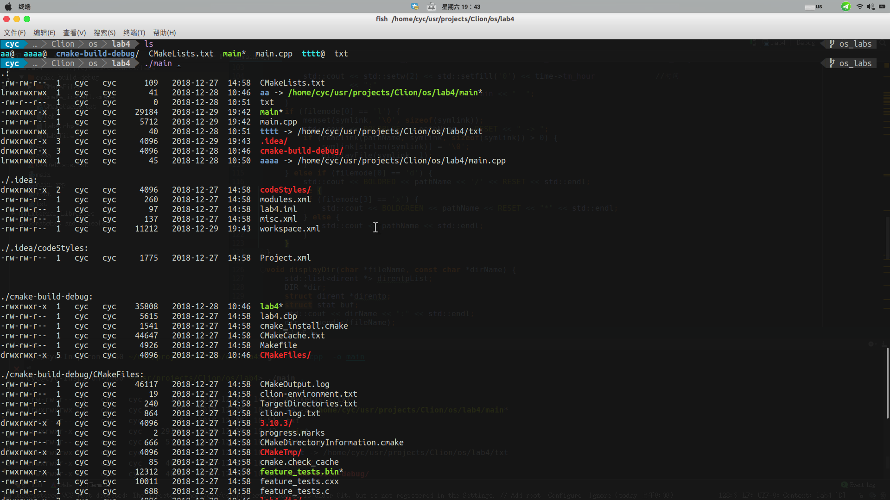

# ls -lR 类似功能实现

> 程序较大程序实现ls -lR的效果

效果图如下:



### `stat` 结构体信息
```c
struct stat {
unsigned long st_dev; // 文件所属的设备
unsigned long st_ino; // 文件相关的 inode
unsigned short st_mode; // 文件的权限信息和类型信息 :
S_IFDIR, S_IFBLK, S_IFIFO, S_IFLINK
unsigned short st_nlink; // 硬连接的数目
unsigned short st_uid; // 文件所有者的 ID
unsigned short st_gid; // 文件所有者的组 ID
unsigned long st_rdev; // 设备类型
unsigned long st_size; // 文件大小
unsigned long st_blksize; // 块大小
unsigned long st_blocks; // 块数
unsigned long st_atime; // 文件最后访问时间
unsigned long st_atime_nsec;
unsigned long st_mtime; // 最后修改内容的时间
unsigned long st_mtime_nsec;
unsigned long st_ctime; // 文件最后修改属性的时间
unsigned long st_ctime_nsec;
unsigned long __unused4;
unsigned long __unused5;
};
```

stat 结构体几乎保存了所有的文件状态信息

- `st_mode` 文件的权限信息和类型信息(drwxrwxrwx)
	- 文件类型信息可以通过 `S_ISDIR` 、`S_IFBLK`、`S_IFIFO` `S_IFLNK`等获得 
	- rwxrwxrwx 不同的位代表不同的权限信息，可以将相应的位与1进行 `&`操作。

- `st_info` 文件相关的inode
- `st_dev` 文件所属的设备
- `st_uid` 文件所有着的ID
- `st_gid` 文件所有者的组 ID
- `st_atime` 文件最后访问时间
- `st_ctime` 文件最后修改时间 ( 修改权限，用户，组或者内容 )
- `st_mtime` 最后修改内容的时间
- `st_nlink` 硬连接的数目 

### Linux 目录结构接口 
- `opendir()`

> 头文件
> \#include<sys/types.h>
> \#include<dirent.h>
> \#include<unistd.h>

```
DIR * opendir(const char *name);
```
通过路径打开一个目录返回一个DIR结构体指针
( 目录流 ) ，失败返回 NULL ；

- `readdir()`

> 头文件
> \#include<sys/types.h>
> \#include<dirent.h>
> \#include<unistd.h>

```
struct dirent *readdir(DIR *)
```
读取目录中的下一个目录项，没有目录项可以读取
时，返回为 NULL ；

 - `chdir()`
 
```
 int chdir(const char *path);
```

改变目录 , 与用户通过 cd 命令改变目录一样，程序也可以
通过 chdir 来改变目录，这样使得 fopen(),opendir(), 这里
需要路径的系统调用，可以使用相对于当前目录的相对路径打
开文件 ( 目录 ) 。

- `closedir()`

```
int closedir(DIR*)
```
关闭目录流

### 目录项结构：

> 头文件
>  /usr/include/dirent.h

```
struct dirent {  
	 #ifndef __USE_FILE_OFFSET64
	 __ino_t d_ino; // 索引节点号  
	 __off_t d_off; // 在目录文件中的偏移
	 #else
	 __ino64_t d_ino;
	 __off64_t d_off;
	 #endif
    unsigned   short   int   d_reclent;     // 文件名的长度
    unsigned   char   d_type;     //d_name 所指的文件类型  
    char   d_name[256];     // 文件名  
  };
```
**注：需跳过两个目录项“ .” 和“ ..” **

## Linux 的文件权限和目录配置

目录与文件的权限意义

- 权限对文件的重要性
	- `r`: 可读取此文件的实际内容。
	- `w`: 可以编辑、新增或者修改该文件的内容(但不含删除该文件)
	- `x`: 该文件具有可以被系统执行的权限
	
- 权限对目录的重要性
	- 目录主要的内容是记录文件名列表，文件名与目录有强烈的关联
	- `r`: 具有读取该目录下的文件名数据，所以可以利用`ls`这个命令将该目录的内容列表显示出来
	- `w`: 表示具有更改该目录结构列表的权限
		- 新建新的文件与目录；
		- 删除已经存在的文件和目录
		- 将已经存在的文件或目录进行重命名
		- 转移该目录内的文件、目录位置
		
	- `x`: 目录的`x`代表用户能否进入该目录成为工作目录。`cd`命令

```

#include <iostream>

#include <sys/types.h>
#include <sys/stat.h>
#include <dirent.h>
#include <time.h>

#include <pwd.h>
#include <grp.h>
#include <cstring>
#include <zconf.h>
#include <list>
#include <string>
#include <iomanip>
//--------------------------------------------------------------------------------
#define RESET   "\033[0m"
#define BLACK   "\033[30m"      /* Black */
#define RED     "\033[31m"      /* Red */
#define GREEN   "\033[32m"      /* Green */
#define YELLOW  "\033[33m"      /* Yellow */
#define BLUE    "\033[34m"      /* Blue */
#define MAGENTA "\033[35m"      /* Magenta */
#define CYAN    "\033[36m"      /* Cyan */
#define WHITE   "\033[37m"      /* White */
#define BOLDBLACK   "\033[1m\033[30m"      /* Bold Black */
#define BOLDRED     "\033[1m\033[31m"      /* Bold Red */
#define BOLDGREEN   "\033[1m\033[32m"      /* Bold Green */
#define BOLDYELLOW  "\033[1m\033[33m"      /* Bold Yellow */
#define BOLDBLUE    "\033[1m\033[34m"      /* Bold Blue */
#define BOLDMAGENTA "\033[1m\033[35m"      /* Bold Magenta */
#define BOLDCYAN    "\033[1m\033[36m"      /* Bold Cyan */
#define BOLDWHITE   "\033[1m\033[37m"      /* Bold White */

//---------------------------------------------------------------------------------

void displayFile(char *pathName, int lFlags) {
    struct stat buf;
    struct tm *time;
    char filemode[11];
    char symlink[100];
    std::ios::fmtflags flag(std::cout.flags());              //save old format
    if (lstat(pathName, &buf) < 0) {
        perror("lstat error");
        return;
    }
    switch (buf.st_mode & S_IFMT) {
        case S_IFREG:
            filemode[0] = '-';
            break;
        case S_IFSOCK:
            filemode[0] = 's';
            break;
        case S_IFLNK:
            filemode[0] = 'l';
            break;
        case S_IFBLK:
            filemode[0] = 'b';
            break;
        case S_IFDIR:
            filemode[0] = 'd';
            break;
        case S_IFCHR:
            filemode[0] = 'c';
            break;
        case S_IFIFO:
            filemode[0] = 'p';
            break;
        default:
            perror("none type");
            break;
    }
    int i = 0;
    while (i < 9) {
        if (buf.st_mode & (1 << i)) {
            switch (i % 3) {
                case 0:
                    filemode[9 - i] = 'x';
                    break;
                case 1:
                    filemode[9 - i] = 'w';
                    break;
                case 2:
                    filemode[9 - i] = 'r';
                    break;
            }
        } else {
            filemode[9 - i] = '-';
        }
        i++;
    }
    time = localtime(&buf.st_mtime);            //文件内容部分修改时间
    filemode[10] = '\0';
    if (!lFlags) {
        std::cout << filemode << "  ";
        std::cout << buf.st_nlink << "  ";
        std::cout << std::setw(4) << std::setfill(' ') << getpwuid(buf.st_uid)->pw_name << "  ";
        std::cout << std::setw(4) << getgrgid(buf.st_gid)->gr_name << "  ";
        if (filemode[0] == 'b' || filemode[0] == 'c')                              //块设备信息或字符设备
            std::cout << (buf.st_rdev >> 8) << " " << (buf.st_rdev & 0xff);         //主设备号　次设备号
        else
            std::cout << std::setw(7) << std::right << buf.st_size << "   ";
        std::cout << time->tm_year + 1900 << "-" << time->tm_mon + 1 << "-" << time->tm_mday << "  ";   //时间

        std::cout << std::setw(2) << std::setfill('0') << time->tm_hour             //时间
                  << ":"
                  << std::setw(2) << time->tm_min << "  ";
    }
    if (filemode[0] == 'l') {
        memset(symlink, '\0', sizeof(symlink));
        std::cout << BOLDBLUE << pathName << RESET << " -> ";
        if (readlink(pathName, symlink, sizeof(symlink)) > 0) {
            symlink[strlen(symlink)] = '\0';
            displayFile(symlink, 1);
        }
    } else if (filemode[0] == 'd') {
        std::cout << BOLDRED << pathName << '/' << RESET << std::endl;
    } else {
        if (filemode[3] == 'x') {
            std::cout << BOLDGREEN << pathName << RESET << "*" << std::endl;
        } else {
            std::cout << pathName << std::endl;
        }
    }
}

void displayDir(char *fileName, const char *dirName) {
    std::list<dirent *> direntpList;
    DIR *dir;
    struct dirent *direntp;
    struct stat buf;
    std::cout << dirName << ":" << std::endl;
    dir = opendir(fileName);
    if (dir == NULL) {
        perror("error");
        return;
    }
    chdir(fileName);
    while ((direntp = readdir(dir)) != NULL) {
        if (lstat(direntp->d_name, &buf) < 0) {
            perror("sss");
        }
        if (S_ISDIR(buf.st_mode)) {
            if (strcmp(direntp->d_name, "..") == 0 || strcmp(direntp->d_name, ".") == 0)
                continue;
            displayFile(direntp->d_name, 0);
            direntpList.push_back(direntp);
        } else
            displayFile(direntp->d_name, 0);
    }
    std::cout << std::endl;
    for (std::list<dirent *>::iterator itr = direntpList.begin(); itr != direntpList.end(); itr++) {
        std::string dirN = std::string(dirName) + "/" + (*itr)->d_name;
        displayDir((*itr)->d_name, dirN.data());
        std::cout << std::endl;
    }
    chdir("..");
    closedir(dir);
}

int main(int argc, char *argv[]) {
    struct stat buf;
    for (int i = 1; i < argc; ++i) {
        if (lstat(argv[i], &buf) < 0) {
            perror("lstat error");
            continue;
        }
        if (S_ISDIR(buf.st_mode)) {
            displayDir(argv[i], argv[i]);
        } else {
            displayFile(argv[i], 0);
        }
    }
    return 0;
}

```
