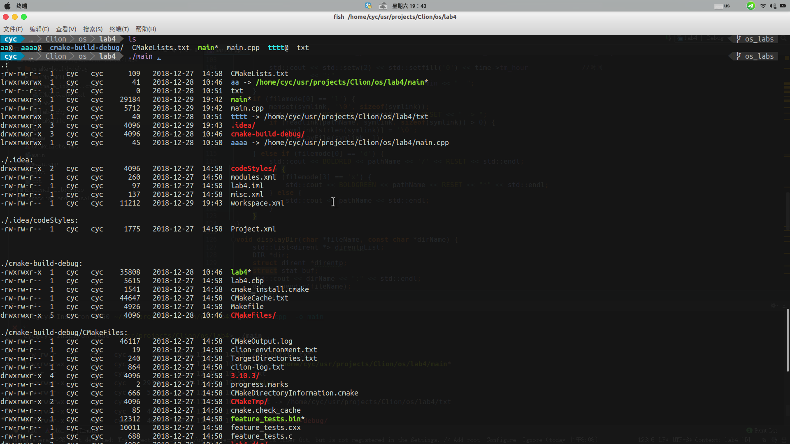

# ls -lR 类似功能实现

> 程序较大程序实现ls -lR的效果

效果图如下:



### `stat` 结构体信息
```c
struct stat {
unsigned long st_dev; // 文件所属的设备
unsigned long st_ino; // 文件相关的 inode
unsigned short st_mode; // 文件的权限信息和类型信息 :
S_IFDIR, S_IFBLK, S_IFIFO, S_IFLINK
unsigned short st_nlink; // 硬连接的数目
unsigned short st_uid; // 文件所有者的 ID
unsigned short st_gid; // 文件所有者的组 ID
unsigned long st_rdev; // 设备类型
unsigned long st_size; // 文件大小
unsigned long st_blksize; // 块大小
unsigned long st_blocks; // 块数
unsigned long st_atime; // 文件最后访问时间
unsigned long st_atime_nsec;
unsigned long st_mtime; // 最后修改内容的时间
unsigned long st_mtime_nsec;
unsigned long st_ctime; // 文件最后修改属性的时间
unsigned long st_ctime_nsec;
unsigned long __unused4;
unsigned long __unused5;
};
```

stat 结构体几乎保存了所有的文件状态信息

- `st_mode` 文件的权限信息和类型信息(drwxrwxrwx)
	- 文件类型信息可以通过 `S_ISDIR` 、`S_IFBLK`、`S_IFIFO` `S_IFLNK`等获得 
	- rwxrwxrwx 不同的位代表不同的权限信息，可以将相应的位与1进行 `&`操作。

- `st_info` 文件相关的inode
- `st_dev` 文件所属的设备
- `st_uid` 文件所有着的ID
- `st_gid` 文件所有者的组 ID
- `st_atime` 文件最后访问时间
- `st_ctime` 文件最后修改时间 ( 修改权限，用户，组或者内容 )
- `st_mtime` 最后修改内容的时间
- `st_nlink` 硬连接的数目 

### Linux 目录结构接口 
- `opendir()`

> 头文件
> \#include<sys/types.h>
> \#include<dirent.h>
> \#include<unistd.h>

```
DIR * opendir(const char *name);
```
通过路径打开一个目录返回一个DIR结构体指针
( 目录流 ) ，失败返回 NULL ；

- `readdir()`

> 头文件
> \#include<sys/types.h>
> \#include<dirent.h>
> \#include<unistd.h>

```
struct dirent *readdir(DIR *)
```
读取目录中的下一个目录项，没有目录项可以读取
时，返回为 NULL ；

 - `chdir()`
 
```
 int chdir(const char *path);
```

改变目录 , 与用户通过 cd 命令改变目录一样，程序也可以
通过 chdir 来改变目录，这样使得 fopen(),opendir(), 这里
需要路径的系统调用，可以使用相对于当前目录的相对路径打
开文件 ( 目录 ) 。

- `closedir()`

```
int closedir(DIR*)
```
关闭目录流

### 目录项结构：

> 头文件
>  /usr/include/dirent.h

```
struct dirent {  
	 #ifndef __USE_FILE_OFFSET64
	 __ino_t d_ino; // 索引节点号  
	 __off_t d_off; // 在目录文件中的偏移
	 #else
	 __ino64_t d_ino;
	 __off64_t d_off;
	 #endif
    unsigned   short   int   d_reclent;     // 文件名的长度
    unsigned   char   d_type;     //d_name 所指的文件类型  
    char   d_name[256];     // 文件名  
  };
```
**注：需跳过两个目录项“ .” 和“ ..” **

## Linux 的文件权限和目录配置

目录与文件的权限意义

- 权限对文件的重要性
	- `r`: 可读取此文件的实际内容。
	- `w`: 可以编辑、新增或者修改该文件的内容(但不含删除该文件)
	- `x`: 该文件具有可以被系统执行的权限
	
- 权限对目录的重要性
	- 目录主要的内容是记录文件名列表，文件名与目录有强烈的关联
	- `r`: 具有读取该目录下的文件名数据，所以可以利用`ls`这个命令将该目录的内容列表显示出来
	- `w`: 表示具有更改该目录结构列表的权限
		- 新建新的文件与目录；
		- 删除已经存在的文件和目录
		- 将已经存在的文件或目录进行重命名
		- 转移该目录内的文件、目录位置
		
	- `x`: 目录的`x`代表用户能否进入该目录成为工作目录。`cd`命令

> 代码以后奉上
