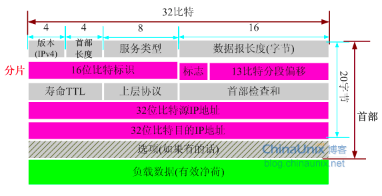
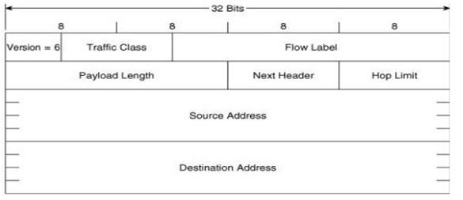

# 网络层

仅在网络层提供连接服务的计算机网络称为**虚电路(Virtual-Circuit, VC)网络**。
仅在网络层提供无连接服务的计算机网络称为**数据报网络(datagram network)**。

##  虚电路网络

仅在网络层提供*连接服务*的计算机网络称为**虚电路(Virtual-Circuit, VC)网络**。

一条虚电路网络组成:
1. 源和目的主机之间的路径(即一系列链路和路由器)
2. **VC** 号,沿着该路径的每段链路的一个号码
3. 沿着该路径的每台路由器的转发表表项

虚电路中３个明显不同的阶段
1. 虚电路建立
2. 数据传送
3. 虚电路拆除

**信令报文**: 端系统向网络发送指示虚电路启动与终止的报文，以及路由器之间传递的用于建立虚电路（即修改路由器表中的连接状态）的报文。

虚电路的概念来源于电话界，采用了真正的电路。

## 数据报网络

在**数据报网络**中，每当一个端系统要发送分组，它就为该分组加上目的端系统的地址，然后将分组推进网络中。**无需建立任何虚电路**，路由器不维护任何虚电路的状态信息(因为没有虚电路)

路由器使用**最长前缀匹配规则**:即在该表中寻找最长的匹配项，并向与最长前缀匹配的相关联的链路转发该分组。

数据报网络在其转发表中维持了**转发状态信息**

> 因特网作为一种数据报网络，是将计算机连接在一起的需求发展而来

## 路由器

- 路由器的转发功能

一台路由器的输入端口、输出端口和交换结构共同实现了转发功能，并且总是由硬件实现，这些转发功能有时总称为**路由转发平面** (转发平面以纳秒时间尺度运行)

- 路由选择功能
**路由器控制平面** 通常由软件实现并在路由选择处理器上执行(通常是一种传统的CPU)

4个组成部分:

- 输入端口
- 交换结构
	- 经总线交换
	- 经内存交换
	- 经互联网络交换
- 输出端口
- 路由选择处理器

## 网际协议: 因特网中的转发和编址
因特网的网络层中三个主要组件:
- `IP` 协议
	- 编址规则
	- 数据报格式
	- 分组处理规则
- 路由选择部分
	- 路径选择
	- `RIP`、 `OSPF`、 `BGP`
- `ICMP`:互联网控制协议。报告数据包中的差错和对某些网络层信息请求进行响应的设施。
	- 差错报告
	- 路由器“信令”

### 数据报格式

#### `IPv4` 数据报格式:
 

IPv4数据报中的关键字段:
- 版本号: `IPv4` 和 `IPv6`
- 首部长度：Ipv4包含一些可变数量的选项（这些选项包含在IPv4数据报首部），故需要这4比特来确定IP数据报中数据部分实际从哪里开始。大部分IP数据报不包含`选项`。
- 服务类型。
- 数据报长度。这是IP数据报的总长度（首部加上数据），以字节计，该字段长为16比特，IP数据报理论长度最大长度是65535字节。
- 标识、标志、片偏移
- 寿命。寿命字段（Time-To-Live，TTL）用来确保数据报不会永远（如由于长时间的路由选择环路）在网络中循环。每当数据报由一台路由器处理时，该字段的值减1。若TTL字段减为0则该数据报必须丢弃。
- 协议。协议是在到大最终目的后，指示IP数据报的数据部分应交给哪个特定的运输协议。`6`表明数据部分交由TCP,`17`表明交给UDP。
> **协议号是将网络层和运输层绑定在一起的粘合剂**
- 首部检验和。用于帮助路由器检测收到的IP数据报中的比特错误。
- 源和目的地址。
- 选项。在 `IPv6` 首部中已去掉了IP`选项`。
- 数据（有效载荷）

#### IP 数据报分片

> 发送方和目的地路径上的每段链路可能使用不同的链路层协议，且每种协议可能具有不同的MTU

**最大传送单元（MTU）**：一个链路层帧能承载的最大数据量

如何将过大的IP分组压缩进链路层帧的有效载荷字段？
将IP数据报中的数据分片成两个或更多个较小的IP数据报，用单独的链路层帧封装这些较小的IP数据报，然后向输出链路上发送这些帧。每个这些较小的数据报都称为	**片** (fragment)。

> 为坚持网络内核保持简单的原则，IPv4的设计者决定将数据报的重新组装工作放在端系统中，而不是放在网络路由器中。

#### IPv4编址

IP地址长度是32比特，因此总共有$ 2^{32} $ 个可能的IP地址。（近似为40亿个可能IP地址）。

地址一般按所谓**点分十进制记法**书写

IP编址为子网分配一个地址。如:233.1.1.0/24。

- 其中/24记法，有时称为**子网掩码**,指示了32比特中最左侧24比特定义了子网地址。

因特网的地址分配策略被称为**无类别域间路由选择(CIDR)**.
	-	$a.b.c.d/x$,其中 $x$ 指示了地址的第一部分中的比特数。地址的$x$最高比特构成了IP地址的网络部分，并且经常被称为该地址的**前缀**，或者网络前缀。
	-	地址剩余的$32-x$比特可被认为是用于区别该组织内部设备的，其中所有设备具有相同的网络前缀。

##### 动态主机配置协议(DHCP)**

动态主机配置协议又常被称为**即插即用协议**

DHCP协议的4个步骤:
1. DHCP服务器发现。
	- 一台新到的主机首要任务是发现一个要与其交互的DHCP服务器。通过**DHCP发现报文**来完成
2. DHCP服务器提供
3. DHCP请求
4. DHCP ACK

> DHCP不足之处：　每当结点连到一个新子网时，要从DHCP的到一个新的IP地址，当一个移动结点在子网之间移动时，就不能维持与远程应用之间的TCP连接。

##### 网络地址转换(NAT)

从本质上讲，NAT使能路由器对外界隐藏了家庭网络的细节。
如果从广域网到达NAT路由器的所有数据报都有相同的目的IP地址，那么该路由器怎么知道它应该将某个分组转发给哪个内部主机，就是使用在NAT路由器上的一张NAT转换表，并且在表项中包含了端口号及其IP地址。

### 因特网控制报文协议(ICMP)

ICMP最典型的用途是差错报告。
ICMP被主机和路由器用来彼此沟通网络层对信息。**目的网络不可达**错误报文的来源，就是ICMP。在某一个位置,IP路由器不能找到一条路径，以通往Telnet、FTP或HTTP应用所指定的主机。该路由器就会向你的主机创建和发送一个类型3的ICMP报文以指示该错误。
ICMP通常被认为是IP的一部分，和TCP和UDP一样。
|类型|	代码|	名称|
|:----|-----:|:-------:|
|0	|0	|回应应答|
|3|	|目的地不可达|
| |0|	网路不可达|
||1|	主机不可达|
||2	|协议不可达|
||3	|端口不可达|
||4|	需要分片和不需要分片标记置位|
||5	|源路由失败|
||6	|目的网络未知|
||7|	目的主机未知|
||8	|源主机被隔离|
||9	|与目的网络的通告被禁止|
||10|	目的主机的通信被禁止|
||11|	对请求的服务类型，目的网路不可达|
||12|	对请求的服务类型，目的主机不可达|
|4|	0	|源抑制（Source Quench）|
|5|	|	重定向|
||0	|为网络（子网）重定向数据报|
||1	|为主机重定向数据报|
||2|	为网络和服务类型重定向数据报|
||3	|为主机和服务类型重定向数据报|
|6|	0	|选择主机地址|
|8|	0	|回应(请求)|
|9|	0	|路由器通告|
|10|	0|	路由器选择|
|11	||	超时|
||0	|传输中超出TTL|
||1	|超出分片重组时间|
|12	||	参数问题|
||0	|指定错误的指针|
||1|	缺少需要的选项|
||2	|错误长度|
|13|	0|	时间戳|
|14|	0	|时间戳回复|
|15|	0	|信息请求（废弃）|
|16|	0	|信息回复（废弃）|
|17|	0	|地址掩码请求|
|18|	0	|地址掩码回复|
|30	||	跟踪路由|
|31	||	数据报会话错误|
|32	||	移动主机重定向|
|33	||	IPv6你在哪里|
|34	||	IPv6我在这里|
|35	||	移动注册请求|
|36	||	移动注册回复|

### IPv6

#### IPv6数据报格式

IPv6数据报的格式

IPv6最重要的变化:
- 扩大的地址容量。IPv6将IP地址长度从32比特增加到128比特
- 简化高效的40字节首部。
- 流标签与优先级。

IPv6中定义的字段：
- 版本: 该4比特字段用于标识IP版本号。该字段值设为`6`。
- 流量类型
- 流标签。
- 有效载荷长度。
- 下一个首部。该字段标识数据报中的内容需要交付给哪个协议（如TCP和UDP）。该字段使用与IPv4首部中协议字段相同的值。
- 跳限制。经过的每台路由器对该字段内容减1，当到达0时将被丢弃。
- 源地址和目的地址。
- 数据

从IPv4到IPv6的迁移:

### 路由选择算法
- LS **链路状态算法**
- DV **距离向量路由选择算法**

### 因特网中的路由选择

#### 因特网中自治系统内部的路由选择

- **路由选择信息协议** :RIP

> RIP是一种距离向量协议。

RIP使用术语**跳**,跳是沿着从源路由器到目的子网（包括目的子网）的最短路径所经过的子网数量，

- **开放最短路优先** : OSPF

- **边界网关协议** : BGP

### 广播和多播路由选择
