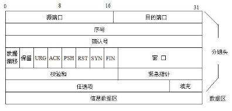

# 运输层

## 运输层概述
运输层协议为运行在不同主机上的*应用进程*之间提供**逻辑通信**。从应用程序角度上看，通过逻辑通信，运行在不同进程的主机好像直接相连一样。
> 网络层提供不同主机之间的逻辑通信
运输层协议是在端系统而不是在路由器上。
运输层两种著名的协议:`TCP` （传输控制协议）和 `UDP`（用户数据报协议）

1. 无连接的多路复用和多路分解
一个**UDP套接字**是由一个二元组全面标识，该二元组包含一个目的IP地址和一个目的端口号。也就是说，如果两个UDP报文段有不同的源地址和/或源端口号，但具有相同的目的IP地址和目的端口号，那么这两个报文段将通过相同的目的套接字被定向到相同的目的进程。

2. 面向连接的多路复用和多路分解
**TCP套接字**是由一个四元组(源IP地址，源端口号，目的IP地址,目的端口号)来标识

TCP连接组成包括：一台主机上的缓存、变量和与进程连接的套接字，以及另一台主机上的另一组缓存、变量和与进程连接的套接字。

### 无连接传输:UDP

- UDP报文段结构

 

UDP首部只有4个字段，每个字段由两个字节组成。
- 源端口号
- 目的端口号
- 长度：指示了在一个UDP段中的字节数（首部加数据）
- 检验和：提供差错检测功能

### 可靠数据传输:rdt

### 面向连接的运输:TCP

TCP被称为是**面向连接的**。
这种TCP连接不是一条虚电路，也不像在电路交换网络中的端到端TDM或FDM电路，因为其连接状态完全保留在两个端系统。由于TCP协议只在端系统中运行，而不在中间的网络元素（路由器和链路层交换机）中运行，所以中间网络元素不会维持TCP连接状态。

- TCP报文段结构

首部包含:
- 源端口
- 目的端口
- 校验和
- 32比特的**序号字段**
- 32比特的**确认号字段**
- 16比特的**接收窗口字段**: 该字段用于流量控制。该字段用于指示接收方愿意接受的字节数量。
- 4比特的**首部长度字段**(**数据偏移**):
- 可选与变长的**选项字段**
- 6比特的**标志字段**
- 紧急指针

### 拥塞控制方法
- **端到端拥塞控制**。网络层没有为运输层拥塞控制提供显示支持。TCP必须通过端到端的方法解决拥塞控制，因为IP层不会向端系统提供有关网络拥塞的反馈信息。TCP报文段的丢失（通过超时或3次冗余确认得知）认为是网络拥塞的一个迹象。
- **网络辅助的拥塞控制**。网络层构件（即路由器）向发送方提供关于网络中拥塞状态的显示反馈信息。　
> 比如：ATM ABR拥塞控制。

- **TCP 拥塞控制**

> TCP 拥塞控制需要解决几个问题:
>  - TCP如何感知从它到目的地之间路径上发生拥塞
>  - TCP 如何限制它向连接发送流量的速率
>  - 感知到拥塞后，采用何种算法改变其发送速率

1. TCP 通过丢包事件来判断是否发生拥塞: 超时或者收到来自接收方的3个冗余的`ACK`(即收到4个`ACK`)。

2. TCP限制发送速率是通过**拥塞窗口（`cmnd`）**进行限制发送方向网络发送流量的速率。在一个发送方中未被确认的数据量不会超过`cwnd`和 `rwnd`中的最小值即:
$$ LastByteSent - LastByteAcked \leq \{{  cwnd, rwnd\}} $$
上面约束限制了发送方中未被确认的数据量，因此间接限制了发送方的发送速率。

3. TCP 拥塞控制算法

**慢启动**
慢启动是当一条TCP开始时，cwnd的值通常初始置为一个MSS的较小值，也就是初始发送速率为$MSS/RTT$, 每当传输的报文段**首次**收到确认就增加1个MSS。即(1,2,4,8....)

如上图所示,TCP发送速率起始慢，但在慢启动阶段以指数增长。
何时结束: 
- 当存在一个由于超时指示的丢包事件（即拥塞）。TCP将重新开始慢启动过程
- 当到达或超过ssthresh的值时，结束慢启动并且转移到拥塞避免模式。
- 当检测到3个冗余ACK时，这时TCP执行一种快速重传并进入快速恢复状态。

**拥塞避免**
一旦进入拥塞避免状态，cwnd的值大约是上次遇到拥塞时的值的一半。TCP无法每过一个RTT再将cwnd的值翻番，而是采用一种较为保守的方法，每个`RTT`只将cwnd的值增加一个MSS。
> **注意是`RTT`，不是首次得到确认**，一种通用方法是每收到一个新的确认就将cwnd增加一个 $MSS \times (MSS/cwnd$)字节
> 比如，如果MSS是1460字节并且cwnd是14600字节，一个RTT内收到10个报文段，则每到达ACK增加$1/10MSS$的拥塞窗口长度。

何时结束：当出现超时时和一个三个冗余ACK事件发生。
- 超时时：与慢启动一样，cwnd 的值设置为1个MSS,当丢包事件出现时，ssthresh的值被更新为cwnd值的一半。
- 出现一个三个冗余ACK事件时: TCP将cwnd的值减半，并且当收到3个冗余的ACK,将ssthresh的值记录为cwnd的一半。

**快速恢复**

**Reno版TCP**和**Tahoe版TCP**

该图阈（yu）`ssthresh`值初始等于8个MSS，在前8个传输回合，Tahoe和Reno采取相同的动作。拥塞窗口在慢启动阶段以指数速度快速爬升，在第4轮传输时到达了阈值。然后拥塞窗口以线性的速度爬升，直到第8轮传输后出现3个冗余ACK。（此时拥塞窗口值为$12 \times MSS$，于是ssthresh的值被设置为$0.5 \times cwnd = 6 \times MSS $ 。在TCP Reno版本下，拥塞窗口被设置为$ cwnd = 9MSS $ ,然后线性增长。在TCP Tahoe下，拥塞窗口被设置为1个MSS,然后呈指数增长，直到到达ssthresh值为止，在这个点它开始线性增长。

**TCP的拥塞控制的FSM描述:**

FSM描述清晰的说明了拥塞控制流程

