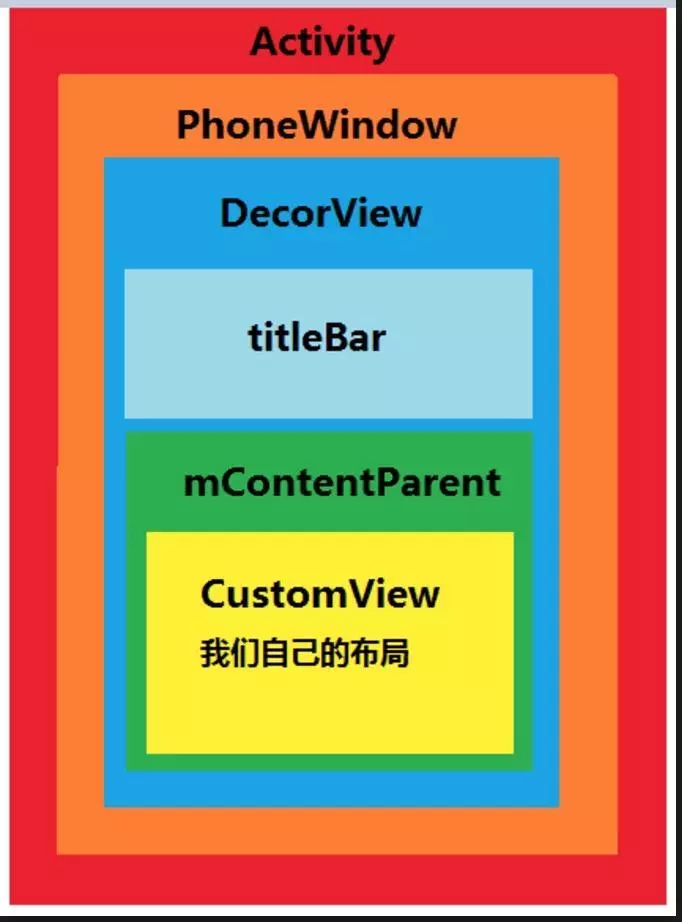
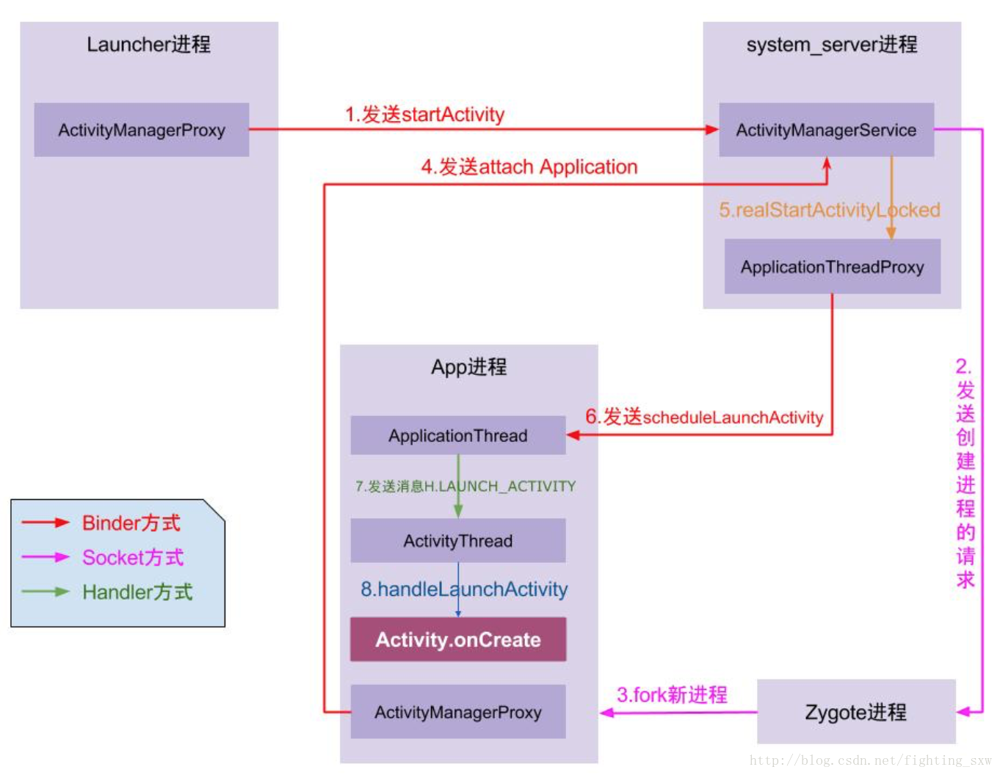

# Android 基础知识


### Activity、View、Window的理解





1、为什么要设计Activity、View、Window？
Activity就像工匠，Window就像是窗户，View就像是窗花，LayoutInflater像剪刀，Xml配置像窗花图纸。
Android根据他们不同的职能让他们各斯其活，同时也相互配合展示给我们灵活、精致的界面。为啥这样设计？因为这样的结构更好管理。就像为啥需要使用MVP、MVVM、各种设计模式一样。

2、Activity工作过程是什么样的？以Activity启动过程为例，Activity启动时是通过Binder向AMS(ActivityManagerService)发请求，通过PIC启动Activity的。

3、Window是什么？它的职能是什么？Activity要管理View需要通过Window来间接管理的。Window通过addView()、removeView()、updateViewLayout()这三个方法来管理View的。

4、View跟Window有什么联系？View需要通过Window来展示在Activity上。

5、Activity、View、Window三者如何关联？Activity包含了一个PhoneWindow，而PhoneWindow就是继承于Window的，Activity通过setContentView将View设置到了PhoneWindow上，而View通过WindowManager的addView()、removeView()、updateViewLayout()对View进行管理。Window的添加过程以及Activity的启动流程都是一次IPC的过程。Activity的启动需要通过AMS完成；Window的添加过程需要通过WindowSession完成。


PopupWindow 和 Dialog 有什么区别

两者最根本的区别在于有没有新建一个window，PopupWindow没有新建，而是将view加到DecorView；Dialog是新建了一个window，相当于走了一遍Activity中创建window的流程

> [原文](<https://www.jianshu.com/p/aa1ffb414f43>)


## 多Activity 切换的生命周期


### Q1: `Activity1` 启动 `Activity2` 问题


```bash
//启动 MainActivity
04-14 23:34:52.692 22963-22963/com.burjal.performancetest I/MainActivity: ====onCreate=====
04-14 23:34:52.692 22963-22963/com.burjal.performancetest I/MainActivity: ====onStart=====
04-14 23:34:52.692 22963-22963/com.burjal.performancetest I/MainActivity: ====onResume=====

//从 MainActivity 打开 SecondActivity
04-14 23:34:57.532 22963-22963/com.burjal.performancetest I/MainActivity: ====onPause=====
04-14 23:34:57.562 22963-22963/com.burjal.performancetest I/SecondActivity: ====onCreate=====
04-14 23:34:57.562 22963-22963/com.burjal.performancetest I/SecondActivity: ====onStart=====
04-14 23:34:57.562 22963-22963/com.burjal.performancetest I/SecondActivity: ====onResume=====
04-14 23:34:57.972 22963-22963/com.burjal.performancetest I/MainActivity: =====onStop====
```


### Q2: 从 `Activity2` 返回 `Activity1` 问题

```
onBackPressed()` 流程：
 `SecondActivity - onPause()` --- `MainActivity - onRestart()` --- `MainActivity - onStart()` --- `MainActivity - onResume()` --- **SecondActivity - onStop()** --- `SecondActivity - onDestroy()
```


### Q3: `Activity1` 启动 `TransActivity2` 问题

我们都知道 `onPause()` 方法是当前 `Activity` 即将进入后台时调用，`onStop()` 方法是当前 `Activity` 不在对用户可见时调用

在 `LifecycleListActivity` 打开 `LifecycleTransActivity`  后，由于 `LifecycleListActivity` 进入后台，所以此时会调用 `LifecycleListActivity - onPause()` 方法。在 `LifecycleTransActivity - onResume()` 后，此时由于 `LifecycleTransActivity` 是透明主题，所以 `LifecycleListActivity` 对用户来说还是可见的(只是不能获取焦点能事件)，**所以不会执行 `LifecycleListActivity - onStop()` 方法** 。

```
04-29 16:40:39.033 16188-16188/com.burjal.androidcomponent I/LifecycleListActivity: ==[onPause]==
04-29 16:40:39.053 16188-16188/com.burjal.androidcomponent I/LifecycleTransActivity: ==[onCreate]==
04-29 16:40:39.083 16188-16188/com.burjal.androidcomponent I/LifecycleTransActivity: ==[onStart]==
04-29 16:40:39.083 16188-16188/com.burjal.androidcomponent I/LifecycleTransActivity: ==[onResume]==
```


### Q4: 从 `TransActivity2` 返回 `Activity1` 问题

> - `onBackPressed()` 流程：
>    `LifecycleTransActivity - onPause()` --- `LifecycleListActivity - onResume()` --- `LifecycleTransActivity - onStop()` --- `LifecycleTransActivity - onDestroy()` 

从透明风格的 `TransActivity` 返回到 `Activity`，生命周期变化基本同 **Q2(普通 Activity 返回问题)**。差别就是，此时返回不需要走 `onRestart() - onStart()` 流程，直接进入返回 `Activity` 的 `onResume()` 方法。

同样，附上测试的Log信息，有Log有真相:

```
04-29 16:59:34.033 16188-16188/com.burjal.androidcomponent I/LifecycleTransActivity: ==[onPause]==
04-29 16:59:34.043 16188-16188/com.burjal.androidcomponent I/LifecycleListActivity: ==[onResume]==
04-29 16:59:34.063 16188-16188/com.burjal.androidcomponent I/LifecycleTransActivity: ==[onStop]==
04-29 16:59:34.063 16188-16188/com.burjal.androidcomponent I/LifecycleTransActivity: ==[onDestroy]==
```


### 结合  **启动模式**  分析


> [详细讲解](<https://blog.csdn.net/mynameishuangshuai/article/details/51491074>)
>
> [Android中Activity四种启动模式和taskAffinity属性详解](<https://blog.csdn.net/zhangjg_blog/article/details/10923643>)


# StartActivity

> [startActivity启动过程分析](<http://gityuan.com/2016/03/12/start-activity/>)




### 